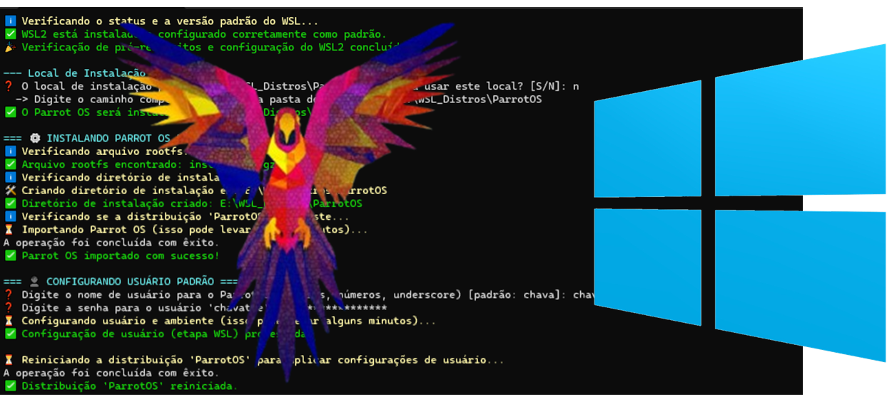

<pre style="font-size: 0.5rem;">

                              \\\\\\
                           \\\\\\\\\\\\
                          \\\\\\\\\\\\\\\
-------------,-|           |C>   // )\\\\|    .o88b. db   db  .d8b.  db    db  .d8b.  d888888b d888888b d88888b
           ,','|          /    || ,'/////|   d8P  Y8 88   88 d8' '8b 88    88 d8' '8b '~~88~~' '~~88~~' 88'  
---------,','  |         (,    ||   /////    8P      88ooo88 88ooo88 Y8    8P 88ooo88    88       88    88ooooo 
         ||    |          \\  ||||//''''|    8b      88~~~88 88~~~88 '8b  d8' 88~~~88    88       88    88~~~~~ 
         ||    |           |||||||     _|    Y8b  d8 88   88 88   88  '8bd8'  88   88    88       88    88.   
         ||    |______      ''''\____/ \      'Y88P' YP   YP YP   YP    YP    YP   YP    YP       YP    Y88888P
         ||    |     ,|         _/_____/ \
         ||  ,'    ,' |        /          |                 ___________________________________________
         ||,'    ,'   |       |         \  |              / \                                           \ 
_________|/    ,'     |      /           | |             |  |                                            | 
_____________,'      ,',_____|      |    | |              \ |      chavatte@duck.com                     | 
             |     ,','      |      |    | |                |                        chavatte.42web.io   | 
             |   ,','    ____|_____/    /  |                |    ________________________________________|___
             | ,','  __/ |             /   |                |  /                                            /
_____________|','   ///_/-------------/   |                 \_/____________________________________________/ 
              |===========,'                                                                                  
			  

</pre>



# Instalador Automatizado do Parrot OS para WSL2

### Um script PowerShell para automatizar a instalação completa do Parrot OS no WSL2, com ambiente gráfico MATE e comandos de gerenciamento simplificados.

<p align="center">
  
  
  
  
  
</p>
<p align="center">
Um conjunto de scripts robustos para configurar, instalar e gerenciar o Parrot OS Security no Subsistema Windows para Linux (WSL2). O instalador cuida de tudo, desde a verificação dos pré-requisitos até a instalação de um ambiente de desktop opcional e a criação de comandos de atalho para facilitar o uso diário.
</p>

---

## Índice

* [✨ Funcionalidades](#-funcionalidades)
* [🚀 Pré-requisitos](#-pré-requisitos)
* [🔧 Como Usar](#-como-usar)
* [⚙️ Opções de Linha de Comando](#️-opções-de-linha-de-comando)
* [🛠️ Comandos Pós-Instalação](#️-comandos-pós-instalação)
* [📁 Estrutura de Arquivos](#-estrutura-de-arquivos)
* [🤝 Contribuições](#-contribuições)
* [📄 Licença](#-licença)

---

## ✨ Funcionalidades

* **Configuração Automática do WSL2:** Verifica se o WSL2 e seus componentes estão ativos e os habilita, se necessário.
* **Instalação Personalizável:** Importa uma imagem rootfs do Parrot OS para o WSL2, permitindo que o usuário escolha um local de instalação personalizado.
* **Criação de Usuário:** Solicita um nome de usuário e senha para configurar um usuário padrão com privilégios `sudo`.
* **Ambiente Gráfico Opcional:** Instala automaticamente o ambiente de desktop MATE e o servidor XRDP, permitindo o acesso via Conexão de Área de Trabalho Remota (RDP).
* **Módulos de Gerenciamento:** Oferece a instalação de comandos PowerShell (`Connect-ParrotGUI` e `Uninstall-ParrotWSL`) para que você possa gerenciar sua instalação de qualquer terminal, mesmo depois de apagar a pasta do projeto.
* **Desinstalador Seguro:** O desinstalador pede confirmação, encerra a distribuição corretamente e remove todos os componentes: a distro, a pasta de instalação e os módulos PowerShell associados.
* **Interface Amigável:** Apresenta um logo de boas-vindas e mensagens coloridas para facilitar a identificação de informações, avisos e erros.

## 🚀 Pré-requisitos

* Windows 10 versão 2004 (build 19041) ou superior, ou Windows 11.
* PowerShell 7 ou superior.
* **Privilégios de Administrador:** A execução do script principal requer uma janela do PowerShell aberta como Administrador.

## 🔧 Como Usar

1.  **Clone o repositório:**
    ```bash
    git clone https://github.com/chavatte/ParrotOS-WSL-Installer
    cd ParrotOS-WSL-Installer
    ```
2.  **Abra o PowerShell como Administrador:**
    Clique com o botão direito no menu Iniciar e selecione "Terminal (Admin)" ou "Windows PowerShell (Admin)".

3.  **Navegue até a pasta raiz do projeto:**
    ```powershell
    cd C:\caminho\para\ParrotWSL-Installer
    ```
4.  **Obtenha o arquivo rootfs (install.tar.gz):**
	O script precisa do sistema de arquivos raiz do Parrot OS para funcionar. Você tem duas opções:
	* **Método Automático (Padrão):** Não faça nada. Ao executar o instalador, ele verificará se o arquivo install.tar.gz existe. Se não existir, ele o baixará automaticamente da seção "Releases" do projeto no GitHub. (Requer conexão com a internet).
	* **Método Manual (Opcional):** Para acelerar o processo ou para instalações offline, baixe o arquivo install.tar.gz da seção "Releases" do projeto. Em seguida, crie a estrutura de pastas Data/rootfs/ na raiz do seu projeto e coloque o arquivo baixado dentro dela.
	
	> **Nota de Transparência e Segurança**
	> Para garantir a integridade do seu ambiente, o arquivo `rootfs` (`install.tar.gz`) utilizado é uma cópia exata e não modificada da imagem oficial. Ela é disponibilizada publicamente pelos desenvolvedores do Parrot OS em seu [repositório oficial no GitLab](https://gitlab.com/parrotsec/project/wsl).

5.  **Permita a execução de scripts (se necessário):**
    Este comando só precisa ser executado uma vez por sessão.
    ```powershell
    Set-ExecutionPolicy -ExecutionPolicy RemoteSigned -Scope Process
    ```
6.  **Execute o instalador principal:**
    A partir da pasta raiz do projeto, execute:
    ```powershell
    .\Main.ps1
    ```
    O script irá guiá-lo interativamente através do processo de instalação.

## ⚙️ Opções de Linha de Comando

Você pode personalizar a instalação com os seguintes parâmetros no `Main.ps1`:

| Parâmetro     | Descrição                                                                                               | Exemplo                                                       |
|---------------|---------------------------------------------------------------------------------------------------------|---------------------------------------------------------------|
| `-InstallPath`| Especifica um caminho completo para a instalação dos arquivos da distribuição.                           | `.\Main.ps1 -InstallPath "D:\MinhasDistros\Parrot"`           |
| `-NoGUI`      | Instala o Parrot OS sem o ambiente gráfico (MATE + XRDP).                                          | `.\Main.ps1 -NoGUI`                                           |
| `-Silent`     | Executa a instalação em modo silencioso, usando os padrões e instalando a GUI sem fazer perguntas. | `.\Main.ps1 -Silent`                                          |
| `-Uninstall`  | Executa o script de desinstalação para remover a distribuição Parrot OS e seus componentes.      | `.\Main.ps1 -Uninstall`                                       |

## 🛠️ Comandos Pós-Instalação

Após a instalação, você pode usar os seguintes comandos no seu terminal:

#### Comandos WSL Padrão

* **Iniciar o terminal padrão:**
    ```powershell
    wsl -d ParrotOS
    ```
* **Entrar como usuário `root`:**
    ```powershell
    wsl -d ParrotOS -u root
    ```

#### Módulos PowerShell (se instalados)

Se você optou por instalar os módulos de gerenciamento, os seguintes comandos estarão disponíveis em **qualquer terminal PowerShell**:

* **Conectar ao Ambiente Gráfico:**
    ```powershell
    Connect-ParrotGUI
    ```
    Para ver todas as opções (como mudar a porta ou o nome da distro), use a ajuda integrada:
    ```powershell
    Get-Help Connect-ParrotGUI -Full
    ```

* **Desinstalar o Parrot OS:**
    ```powershell
    Uninstall-ParrotWSL
    ```
    Este comando também possui ajuda integrada e parâmetros úteis:
    ```powershell
    # Exibe todas as opções, como -InstallPath e -Force
    Get-Help Uninstall-ParrotWSL -Full
    
    # Exemplo para remover uma instalação em caminho customizado sem pedir confirmação
    Uninstall-ParrotWSL -InstallPath "D:\MinhasDistros\Parrot" -Force
    ```

## 📁 Estrutura de Arquivos

A estrutura de arquivos foi concebida para ser limpa e intuitiva:
```
ParrotWSL-Installer/
├── Assets/
│   ├── logo.png                  # Imagem do logo para o README
│   └── logo.txt                  # Arte ASCII para a tela de boas-vindas
├── Data/
│   └── rootfs/                   # Local onde o 'install.tar.gz' será baixado/colocado
│       └── (install.tar.gz)      # (Este arquivo é baixado pelo script)
├── Scripts/
│   ├── Bash/                     # Scripts Bash executados dentro do WSL
│   │   ├── configure_parrot_internal.sh
│   │   └── setup_gui_internal.sh
│   └── PowerShell/               # Módulos PowerShell com as funções principais
│       ├── Configure-GUI.ps1
│       ├── Connect-ParrotGUI.ps1
│       ├── Enable-WSL2.ps1
│       ├── Install-ParrotWSL.ps1
│       ├── Install-PSModule.ps1
│       ├── Show-Logo.ps1
│       └── Uninstall-ParrotWSL.ps1
├── .gitignore                    # Arquivo para ignorar arquivos no Git
├── LICENSE                       # Licença do projeto (MIT)
├── Main.ps1                      # Orquestrador principal da instalação (executável)
├── Uninstall.ps1                 # Script para facilitar a desinstalação (executável)
└── README.md                     # Documentação do projeto
```

## 🤝 Contribuições

Contribuições são bem-vindas! Se você encontrar um bug ou tiver uma sugestão de melhoria, sinta-se à vontade para abrir uma *issue* ou enviar um *pull request*.

## 📄 Licença

Este projeto é distribuído sob a licença MIT. Veja o arquivo `LICENSE` para mais detalhes.