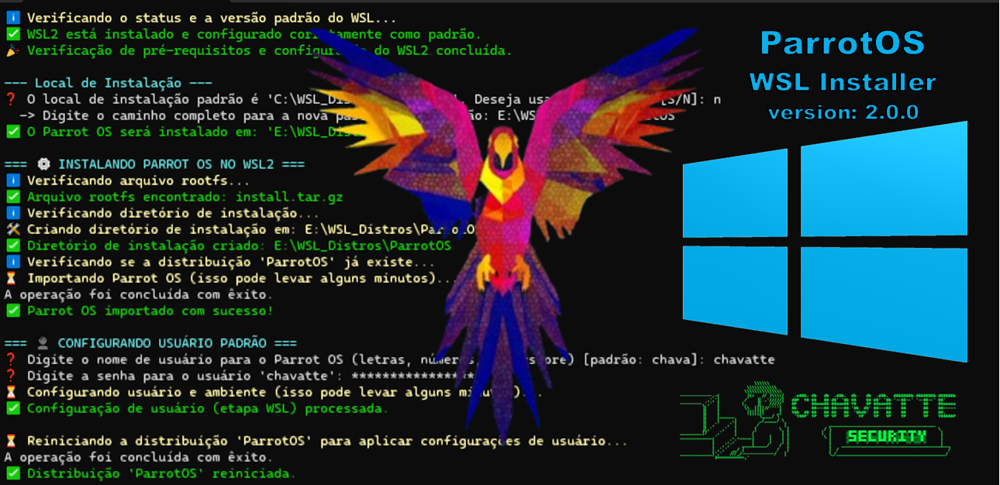

<pre style="font-size: 0.5rem;">

                              \\\\\\
                           \\\\\\\\\\\\
                          \\\\\\\\\\\\\\\
-------------,-|           |C>   // )\\\\|    .o88b. db   db  .d8b.  db    db  .d8b.  d888888b d888888b d88888b
           ,','|          /    || ,'/////|   d8P  Y8 88   88 d8' '8b 88    88 d8' '8b '~~88~~' '~~88~~' 88'  
---------,','  |         (,    ||   /////    8P      88ooo88 88ooo88 Y8    8P 88ooo88    88       88    88ooooo 
         ||    |          \\  ||||//''''|    8b      88~~~88 88~~~88 '8b  d8' 88~~~88    88       88    88~~~~~ 
         ||    |           |||||||     _|    Y8b  d8 88   88 88   88  '8bd8'  88   88    88       88    88.   
         ||    |______      ''''\____/ \      'Y88P' YP   YP YP   YP    YP    YP   YP    YP       YP    Y88888P
         ||    |     ,|         _/_____/ \
         ||  ,'    ,' |        /          |                 ___________________________________________
         ||,'    ,'   |       |         \  |              / \                                           \ 
_________|/    ,'     |      /           | |             |  |                                            | 
_____________,'      ,',_____|      |    | |              \ |      chavatte@duck.com                     | 
             |     ,','      |      |    | |                |                       chavatte.vercel.app  | 
             |   ,','    ____|_____/    /  |                |    ________________________________________|___
             | ,','  __/ |             /   |                |  /                                            /
_____________|','   ///_/-------------/   |                 \_/____________________________________________/ 
              |===========,'                                                                          
			  

</pre>



<p align="center">
  
  
  
  
  
  
</p>

---

<h3 align="center">🌍 Choose your language | Escolha o seu idioma:</h3>
<p align="center">
  <a href="#-english-version">🇺🇸 English Version (Default)</a>   |   <a href="#-versão-em-português">🇧🇷 Versão em Português</a>
</p>

---

# 🇺🇸 English Version

# Automated Parrot OS Installer for WSL2 (Secure Edition)

### A robust PowerShell framework developed by **Chavatte Security** to automate the complete, secure, and optimized installation of Parrot OS on WSL2, featuring a MATE graphical environment and security hardening.

<p align="center">
This project provides a suite of defensive scripts to configure, install, and manage Parrot OS Security within the Windows Subsystem for Linux (WSL2). The installer orchestrates everything from cryptographic integrity checks to deploying a hardened desktop environment, providing simplified management modules for professional Pentesting and Cybersecurity use.
</p>

## Table of Contents

* [🛡️ Security Hardening](#️-security-hardening)
* [✨ Features](#-features)
* [🚀 Prerequisites](#-prerequisites)
* [🔧 How to Use](#-how-to-use)
* [⚙️ Command Line Options](#️-command-line-options)
* [🛠️ Post-Installation Commands](#️-post-installation-commands)
* [📁 File Structure](#-file-structure)
* [🤝 Contributions](#-contributions)
* [📄 License](#-license)

---

## 🛡️ Security Hardening

Unlike standard installations, this project applies **Defensive Security** layers during deployment:

* **SHA256 Integrity Validation:** Cryptographic audit of the `rootfs` file prior to importation to mitigate Supply Chain attacks.
* **Memory Sanitization (Zeroization):** Credentials and passwords are handled via `SecureString` and destroyed from RAM immediately after use through forced Garbage Collection, preventing malicious memory dumps.
* **Privileged Auto-Elevation (UAC):** Automatic detection of execution context (PowerShell 5/7) and secure UAC prompting for critical Kernel and Hyper-V configurations.
* **Hardened XRDP:** Forced TLS encryption for RDP connections, high-level cryptography, and explicit disabling of GUI root login.

## ✨ Features

* **Automated WSL2 Configuration:** Verifies and enables native features like 'VirtualMachinePlatform' and the Linux subsystem.
* **Global i18n Support:** The framework automatically detects the host OS language and adapts the entire CLI interface and logs (English standard, Portuguese supported).
* **Core SecOps Tools Injection:** Optional automated installation of tactical tools (`nmap`, `git`, `tmux`, `curl`, etc.) without bloating the base image.
* **Isolated Graphical Environment:** Modular installation of MATE Desktop and XRDP server optimized for Windows, utilizing VNC backend and DBUS rendering.
* **Diagnostic Logging:** Captures STDOUT/STDERR buffers from internal WSL processes directly into the Windows terminal for transparent troubleshooting.
* **Permanent Management Modules:** Installs global PowerShell commands (`Connect-ParrotGUI` and `Uninstall-ParrotWSL`) integrated directly into your profile.
* **Audit Uninstaller:** Fully removes the distribution, terminates zombie processes, deletes disk files, and scrubs modules securely.

## 🚀 Prerequisites

* **Operating System:** Windows 10 version 2004 (build 19041) or higher, or Windows 11.
* **Tools:** PowerShell 7 or higher is recommended.
* **Privileges:** The script features **Auto-Elevation**, but the user must accept the UAC prompt when requested.

## 🔧 How to Use

1. **Clone the repository:**

   ```bash
   git clone https://github.com/chavatte/ParrotOS-WSL-Installer
   cd ParrotOS-WSL-Installer
   ```

2. **Launch the Main Orchestrator:**
   Run the script at the project root. The system will automatically detect and request Administrator privileges if needed.
   **PowerShell**

   ```
   .\\Main.ps1
   ```
3. **Interactive Guide:**
   Upon starting, you can load the  **Chavatte Security Setup Wizard** , which details every deployment phase.
4. **Execution Policy:**
   If you encounter script permission errors, run the following in your terminal:
   **PowerShell**

   ```
   Set-ExecutionPolicy -ExecutionPolicy RemoteSigned -Scope Process
   ```

## ⚙️ Command Line Options

Customize your deployment by appending parameters to `Main.ps1`:

| **Parameter**   | **Description**                                                                   |
| --------------------- | --------------------------------------------------------------------------------------- |
| `-InstallPath`      | Sets a custom path for the distro's VHDX files.                                         |
| `-NoGUI`            | Installs only the CLI terminal, skipping desktop and XRDP setup.                        |
| `-Silent`           | Full automation mode: uses default paths and installs GUI without confirmation prompts. |
| `-Uninstall`        | Triggers the secure removal mode for the distribution and its modules.                  |
| `-InteractiveGuide` | Forces the display of the security explanatory guide before starting.                   |

## 🛠️ Post-Installation Commands

#### Secure CLI Access

**PowerShell**

```
wsl -d ParrotOS
# Or for direct administrative access:
wsl -d ParrotOS -u root
```

#### Chavatte Security Utilities (If installed)

* **Connect to Graphical Interface:**
  **PowerShell**

  ```
  Connect-ParrotGUI
  ```
* **Complete Uninstallation:**
  **PowerShell**

  ```
  Uninstall-ParrotWSL -Force
  ```

---

---

# 🇧🇷 Versão em Português

# Instalador Automatizado do Parrot OS para WSL2 (Secure Edition)

### Um framework robusto em PowerShell desenvolvido pela **Chavatte Security** para automatizar a instalação completa, segura e otimizada do Parrot OS no WSL2, com ambiente gráfico MATE e hardening de segurança.

## Índice

* [🛡️ Hardening de Segurança](https://www.google.com/search?q=%23%EF%B8%8F-hardening-de-seguran%C3%A7a-1)
* [✨ Funcionalidades](https://www.google.com/search?q=%23-funcionalidades-1)
* [🚀 Pré-requisitos](https://www.google.com/search?q=%23-pr%C3%A9-requisitos-1)
* [🔧 Como Usar](https://www.google.com/search?q=%23-como-usar-1)
* [⚙️ Opções de Linha de Comando](https://www.google.com/search?q=%23%EF%B8%8F-op%C3%A7%C3%B5es-de-linha-de-comando-1)
* [🛠️ Comandos Pós-Instalação](https://www.google.com/search?q=%23%EF%B8%8F-comandos-p%C3%B3s-instala%C3%A7%C3%A3o-1)
* [📁 Estrutura de Arquivos](https://www.google.com/search?q=%23-file-structure--estrutura-de-arquivos)
* [🤝 Contribuições](https://www.google.com/search?q=%23-contribui%C3%A7%C3%B5es-1)
* [📄 Licença](https://www.google.com/search?q=%23-licen%C3%A7a-1)

---

## 🛡️ Hardening de Segurança

Diferente de instalações padrão, este projeto aplica camadas de **Defensive Security** durante o deploy:

* **Validação de Integridade SHA256:** Auditoria criptográfica do arquivo `rootfs` antes da importação para mitigar ataques de  *Supply Chain* .
* **Sanitização de Memória (Zeroization):** Credenciais e senhas são tratadas via `SecureString` e destruídas da RAM imediatamente após o uso através de *Garbage Collection* forçado, impedindo dumps de memória maliciosos.
* **Auto-Elevação Privilegiada (UAC):** Detecção automática de contexto (PowerShell 5/7) e solicitação de UAC segura para configurações críticas de Kernel e Hyper-V.
* **XRDP Blindado:** Configuração forçada de TLS para conexões RDP, nível de criptografia alto e desativação explícita de login para o usuário `root` via interface gráfica.

## ✨ Funcionalidades

* **Configuração Automática do WSL2:** Verifica e habilita recursos nativos como 'VirtualMachinePlatform' e o subsistema Linux.
* **Suporte i18n Global (Data-Driven):** O framework detecta automaticamente o idioma do sistema operacional hospedeiro e adapta toda a interface e logs através de dicionários `.psd1` (Padrão Inglês, suporte a Português).
* **Injeção de Core Tools:** Instalação automatizada opcional de ferramentas táticas (`nmap`, `git`, `tmux`, `curl`, etc.) sem inflar a imagem base.
* **Ambiente Gráfico Isolado:** Instalação modular do MATE Desktop e servidor XRDP otimizado para o Windows (utilizando VNC Backend e renderização via DBUS).
* **Log de Diagnóstico:** Captura buffers de STDOUT/STDERR de processos internos do WSL diretamente para o terminal do Windows, garantindo troubleshooting transparente.
* **Módulos de Gerenciamento Permanente:** Instala comandos globais (`Connect-ParrotGUI` e `Uninstall-ParrotWSL`) integrados diretamente ao perfil do PowerShell do usuário.
* **Desinstalador de Auditoria:** Remove a distribuição, encerra processos zumbis, apaga arquivos de disco e limpa módulos do sistema de forma segura.

## 🚀 Pré-requisitos

* **Sistema Operacional:** Windows 10 versão 2004 (build 19041) ou superior, ou Windows 11.
* **Ferramental:** PowerShell 7 ou superior é recomendado.
* **Privilégios:** O script agora possui  **Auto-Elevação** , mas o usuário deve aceitar o prompt do UAC quando solicitado.

## 🔧 Como Usar

1. **Clone o repositório:**
   **Bash**

   ```
   git clone https://github.com/chavatte/ParrotOS-WSL-Installer
   cd ParrotOS-WSL-Installer
   ```
2. **Inicie o Orquestrador Principal:**
   Execute o script na raiz do projeto. O sistema detectará automaticamente a necessidade de privilégios de Administrador.
   **PowerShell**

   ```
   .\\Main.ps1
   ```
3. **Guia Interativo:**
   Ao iniciar, você terá a opção de carregar o  **Assistente de Instalação Chavatte Security** , que explicará detalhadamente cada fase do deploy.
4. **Política de Execução:**
   Caso receba erros de permissão de script, execute no terminal atual:
   **PowerShell**

   ```
   Set-ExecutionPolicy -ExecutionPolicy RemoteSigned -Scope Process
   ```

## ⚙️ Opções de Linha de Comando

Personalize o seu deploy utilizando parâmetros diretamente no `Main.ps1`:

| **Parâmetro**  | **Descrição**                                                                      |
| --------------------- | ------------------------------------------------------------------------------------------ |
| `-InstallPath`      | Define um caminho customizado para os arquivos do VHDX da distro.                          |
| `-NoGUI`            | Instala apenas o terminal (CLI), pulando o setup de desktop e XRDP.                        |
| `-Silent`           | Modo automação total: usa caminhos padrão e instala a GUI sem prompts de confirmação. |
| `-Uninstall`        | Aciona o modo de remoção segura da distribuição e seus módulos.                       |
| `-InteractiveGuide` | Força a exibição do guia explicativo de segurança antes do início.                    |

## 🛠️ Comandos Pós-Instalação

#### Acesso Seguro via CLI

**PowerShell**

```
wsl -d ParrotOS
# Ou para acesso administrativo direto:
wsl -d ParrotOS -u root
```

#### Utilitários Chavatte Security (Se instalados)

* **Conectar à Interface Gráfica:**
  **PowerShell**

  ```
  Connect-ParrotGUI
  ```
* **Desinstalação Completa:**
  **PowerShell**

  ```
  Uninstall-ParrotWSL -Force
  ```

---

## 📁 File Structure | Estrutura de Arquivos

**Plaintext**

```
ParrotWSL-Installer/
├── Assets/
│   ├── logo.png                  # Visual identity / Identidade visual
│   └── logo.txt                  # ASCII Art
├── Data/
│   └── rootfs/                   # RootFS Repository (SHA256 audited)
├── Scripts/
│   ├── Bash/                     # Internal Linux code injection
│   │   ├── configure_parrot_internal.sh  (User/Sudo setup)
│   │   ├── install_tools_internal.sh     (Core SecOps Tools)
│   │   └── setup_gui_internal.sh         (Hardened XRDP/MATE)
│   └── PowerShell/               # Windows orchestration modules
│       ├── Locales/                      # i18n Data-Driven Dictionaries
│       │   ├── en-US.psd1                (English strings)
│       │   └── pt-BR.psd1                (Portuguese strings)
│       ├── Configure-GUI.ps1
│       ├── Connect-ParrotGUI.ps1
│       ├── Enable-WSL2.ps1
│       ├── Get-Locale.ps1                (i18n Engine)
│       ├── Install-ParrotTools.ps1
│       ├── Install-ParrotWSL.ps1         (Memory Sanitization logic)
│       ├── Install-PSModule.ps1
│       ├── Show-Logo.ps1
│       └── Uninstall-ParrotWSL.ps1
├── Main.ps1                      # Orchestrator / Orquestrador (Auto-Elevation)
├── Uninstall.ps1                 # Quick removal wrapper / Wrapper de remoção rápida
├── changelog.md                  # Project versions and updates / Log de atualizações
└── README.md                     # Technical Documentation / Documentação Técnica
```

## 🤝 Contributions | Contribuições

Contributions focusing on WSL kernel performance or Linux service hardening are highly welcome. Feel free to open an *issue* or submit a  *pull request* .

*(Contribuições focadas em performance de kernel WSL ou hardening de serviços Linux são muito bem-vindas).*

## 📄 License | Licença

This project is distributed under the MIT license by  **João Carlos Chavatte (Chavatte Security)** . See the `LICENSE` file for legal details.

*(Este projeto é distribuído sob a licença MIT por Chavatte Security. Veja o arquivo LICENSE para detalhes jurídicos).*
